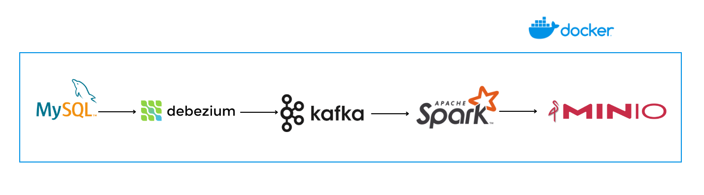
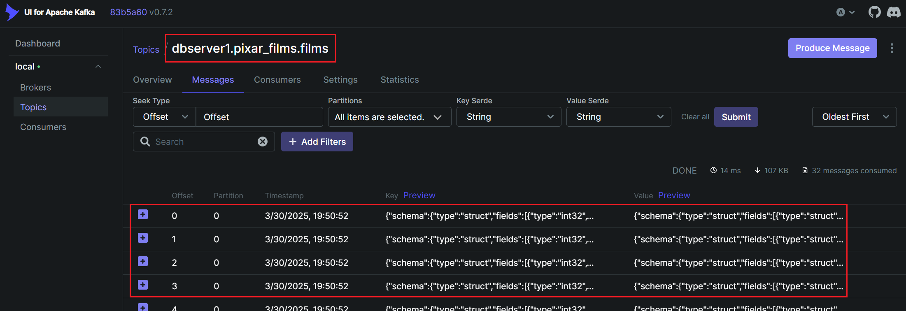

# Changed Data Capture (CDC) from MySQL to MinIO Delta Table with Debezium and Spark

A Docker-based pipeline to ingest and synchronize data from MySQL to MinIO Delta Table using Debezium for Changed Data Capture (CDC) and Spark for processing. Designed for real-time data replication and analytics.



**What this project has done**
- Captures MySQL changes via Debezium (CDC).
- Processes data with Apache Spark.
- Stores results as Delta Tables in MinIO (S3-compatible storage).
- Fully containerized with Docker for scalability.

## Prerequisites
WSL version: 

Docker version:

[Read: Installing Docker on WSL](https://docs.docker.com/engine/install/ubuntu/#install-using-the-repository)

## Dataset
This project uses the Pixar Films dataset from [Maven Analytics](https://mavenanalytics.io/data-playground).

## Set up Docker services
### 1. MySQL
MySQL 8.0

Database: pixal_films

Check if the database is built successfully:

```
$ docker exec -it mysql mysql -u <your database user> -p -D pixar_films
Enter password:
```

```
mysql> show tables;
+-----------------------+
| Tables_in_pixar_films |
+-----------------------+
| film_ratings          |
| films                 |
+-----------------------+
2 rows in set (0.01 sec)
```

```mysql> select * from films;```

### 2. MinIO
MinIO UI: `localhost:9001`

### 3. Kafka
- ZooKeeper 3.0
- Kafka 3.0
- Kafka UI: `localhost:9089`

### 4. Kafka Connector Debezium
Debezium 3.0

### 5. Spark
- Spark Master 3.5
- Spark Worker 3.5
- Spark UI: `localhost:8080`

**Note:** *You can have 2 ways to set up libraries for Spark to work with Kafka.*

- Manually download jar files listed in `spark/jars/jarsfiles` and put them in the directory `/opt/bitnami/spark/jars` of the container, or
- Add this configuration in `spark-default.conf` as below:

```spark.jars.packages                                 org.apache.spark:spark-sql-kafka-0-10_2.12:3.5.0```

**All the jar libraries are version compatible with services used in this project.**

## Run the pipeline
### 1. Run all docker services

```docker compose up -d```

### 2. Create a connector between MySQL and Kafka

- Check if Debezium is running:
```
$ curl -H "Accept:application/json" localhost:8083/connectors/
[]
```
- Create a connector with the configuration file:

```
$ curl -i -X POST -H "Accept:application/json" -H "Content-Type:application/json" localhost:8083/connectors/ -d @mysql-connector.json
HTTP/1.1 201 Created
Date: Sun, 30 Mar 2025 14:59:35 GMT
Location: http://localhost:8083/connectors/mysql-connector
Content-Type: application/json
Content-Length: 489
Server: Jetty(9.4.56.v20240826)
```

- Check again if the connector is created:

```
$ curl -H "Accept:application/json" localhost:8083/connectors/
["mysql-connector"]
```
### 3. Kafka UI

Changed data are captured as messages under the topic `dbserver1.pixar_films.films` as configured in Kafka Connector.



### 4. Submit a Spark job to stream from Kafka to MinIO

```docker exec -u root -it spark-master bin/spark-submit /app/stream.py```

This Spark application consumes CDC events from Kafka (emitted by Debezium) and synchronizes them into a Delta Table in MinIO.

Change your data in the source database to see the real-time updates on the sink delta table (written in the `stream.log`).
